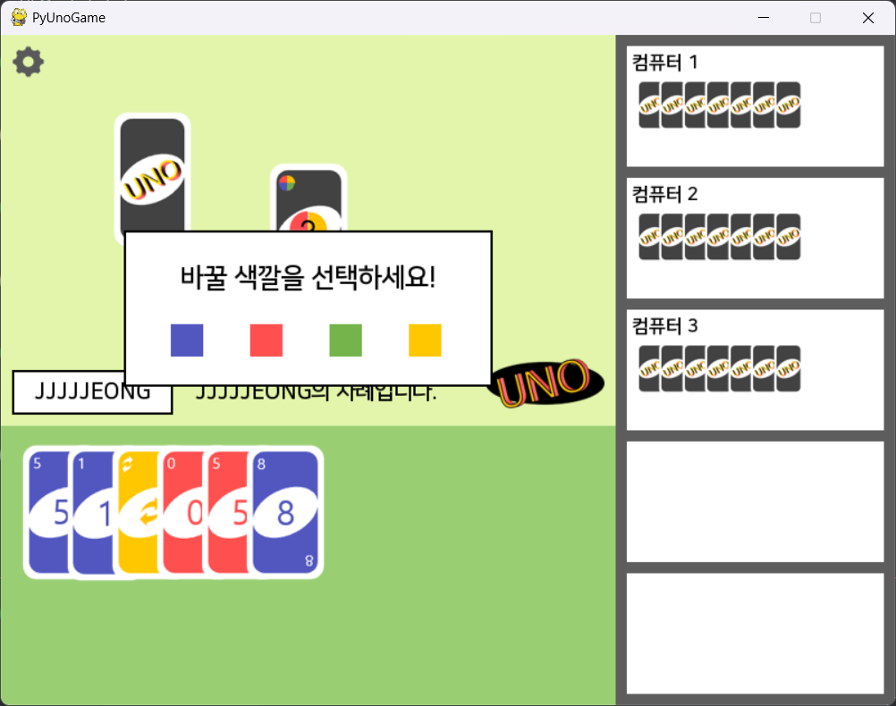

<div align="center">

# ONO
> **파이게임으로 만든 우노 게임**

</div>


## 프로젝트 정보 
- 파이게임, 2개월 / 4명
- 컴퓨터와 플레이어가 우노를 하는 게임 
- 소프트웨어 공학 수업에서 만든 팀프로젝트 
- [시연 영상](https://youtu.be/O_AEygtcm3I)
<table>
  <tr>
    <td></td>
  </tr>
</table>


## 클래스 구조 
```
📦classes
 ┣ 📂cards
 ┃ ┣ 📜card.py  # 카드 속성과 규칙 정의 
 ┃ ┣ 📜numeric_card.py  # 일반 숫자 카드 로직
 ┃ ┣ 📜special_cards.py # 특수 카드(Skip, Reverse, Draw2) 로직
 ┃ ┗ 📜wild_cards.py    # 와일드 카드(색상 변경, Draw4) 로직
 ┣ 📂decks
 ┃ ┣ 📜game_deck.py # 중앙 테이블 덱 관리, 카드 섞기 기능
 ┃ ┗ 📜player_deck.py   # 개별 플레이어 패 관리, 카드 내는 기능 
 ┣ 📂enums
 ┃ ┣ 📜colors.py    # 카드 색상 Enum으로 관리
 ┃ ┗ 📜directions.py    # 게임 진행 방향 정의
 ┣ 📂game   # 턴 관리, 승패 판정, 룰 검사 등 전반적인 게임 루프, 상태 머신 제어
```


## 시스템

**게임 플레이**
- 같은 색, 같은 숫자인 카드를 내거나 새로운 카드를 먹을 수 있는 규칙에서 보유한 카드를 모두 소진하는 것을 목표로 함 


## 담당
### Client 
- Card, Deck, Game 클래스로 도메인 분리하는 구조 설계 및 독립적인 게임 루프 상태 관리 
- JSON 파일을 이용한 데이터 기반 업적 시스템 설계   
- 스토리 모드에서 지역별 다른 규칙과 컴퓨터 AI의 행동 가중치 기능 구현


## 일화

**문제 발생**: 첫 팀프로젝트여서 협업 경험이 부족해 코드 변경 사항 파악에 어려움이 발생했고, 머지 충돌 대처 미흡 및 파트간 소통 부족 발생

**해결 방법**: 일정 주기마다 디스코드에 작업 일지를 공유함. 정기적으로 스크럼, 스프린트 회의를 진행해 진행 상황과 이슈를 실시간으로 공유함. 충돌이 나는 경우 담당 파트원과 화면 공유해 고쳐나감.

<br>

**문제 발생**: 기존 코드는 UI 렌더링 코드와 게임 핵심 로직이 결합되어 머지시 잦은 충돌 발생

**해결 방법**: Card, Deck, Game을 별도의 클래스로 분리해 결합도를 낮춤. 파트별 독립적인 작업이 가능해져 머지 충돌 횟수 감소